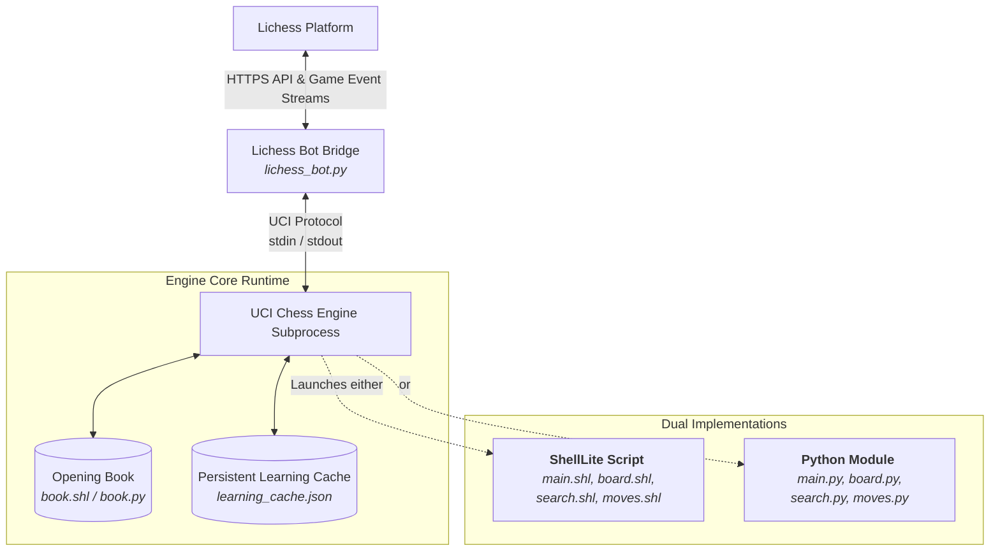

# ShellLite Chess Engine & Lichess Bot

[](https://github.com)
[](https://images.chesscomfiles.com/uploads/v1/images_users/tiny_mce/pete/php6097d6a546da1.png)
[](LICENSE)
[](https://lichess.org)

Dual language chess engine written from scratch in the **ShellLite** programming language and **Python** (for the lichess bot), featuring a multithreaded **Lichess Bot Bridge** for automated online matchplay.

## Workflow

The system is split into two primary components: **UCI engine loop** (running ShellLite) and a **Lichess Bot Bridge** which handles event polling, stream connections, and isolates concurrent game computation inside distinct subprocesses.



---

## Features

### 1. Search Algorithms (`search.shl`)
*   **Negamax Framework with Alpha Beta Pruning**: The core depth first minimax search, optimized to trim the search space early and effectively.
*   **Iterative Deepening**: Dynamically increases search depth step by step, allowing the engine to return the best-known move instantly if allocated time runs out.
*   **Quiescence Search**: Solves the horizon effect by extending search depths solely for tactical captures until a "quiet" position is reached, using a dedicated **Legal Capture Generator**.
*   **Aspiration Windows**: Narrows search windows around the previous depth's evaluation score to speed up alpha beta pruning.
*   **Zobrist Hashing**: Generates unique, 64-bit board state signatures to enable fast transposition lookups and draw by threefold repetition checks.
*   **Transposition Table (TT)**: Caches search results (`depth`, `val`, `flag`, and `best_move`) to prevent redundant analysis of transposed positions.
*   **Session to Session Learning Cache**: Automatically persists valuable deep-search transposition entries into `learning_cache.json` across executions. The engine literally gets smarter the more games it plays!
*   **Move Ordering Optimization**:
    *   *PV / Hash Move*: Analyzes the principal variation or cached TT move first.
    *   *MVV LVA*: Most Valuable Victim - Least Valuable Aggressor ordering for captures.
    *   *Killer Moves Heuristic*: Prioritizes quiet moves that caused beta cutoffs at the same ply in sibling branches.
    *   *History Heuristic*: Prioritizes moves that historically caused beta cutoffs across the entire search tree.
*   **Null Move Pruning**: Speeds up search in non-tactical positions by passing the turn (null move) to verify if the opponent is unable to create threats.

### 2. Positional Heuristics Evaluation
*   **Dynamic Material & PST Scoring**: Uses localized **Piece-Square Tables (PST)** to guide piece development, space control, and pawn structures.
*   **Mobility Bonuses**: Grants score adjustments based on the active mobility (number of legal target squares) of Knights, Bishops, Rooks, and Queens.
*   **Pawn Structure Auditing**:
    *   Doubled pawn penalty (`-15`).
    *   Isolated pawn penalty (`-12`).
    *   Passed pawn advancement reward (`+20` standard bonus, plus end-game rank amplification).
    *   Blocked pawn configurations are carefully identified.
*   **Positional Rules**:
    *   *Bishop Pair Bonus*: Rewards players possessing both active bishops (`+40`).
    *   *Rooks on Open/Semi-Open Files*: Scores extra credit for rooks on files without friendly pawns (`+15`) or fully open files (`+30`).
    *   *Castled King Safety*: Penalizes open files and missing pawn shields in front of a castled king (`-20` per missing pawn).
*   **Endgame Strategy**:
    *   Automatically shifts to **King Endgame PSTs** when queens are traded off or pieces are scarce, pushing the king into the active center.
    *   Applies a distance based Mop-Up penalty/reward to drive lone enemy kings to corner squares and draw friendly kings closer for checkmate delivery.

---

## Project Structure

The project maintains parallel source code trees, making it versatile to run in either native ShellLite script or standard Python.

```
ChessEngine/
│
├── Core Engine Modules (ShellLite Script & Python equivalents)
│   ├── constants.shl / constants.py   # Board & piece designations
│   ├── board.shl / board.py           # FEN parsing, Zobrist hashing, make/undo
│   ├── moves.shl / moves.py           # Pseudo-legal & legal move generators
│   ├── search.shl / search.py         # Negamax, alpha beta, quiescence, PSTs
│   └── book.shl / book.py             # Openings lookup engine & moves database
│
├── Main Applications
│   ├── main.shl / main.py             # Standard UCI engine loop implementations
│   ├── lichess_bot.py                 # Multi threaded Lichess bot polling client
│   └── run_perft.shl / run_perft.py   # Performance move-generator validation suite
│
├── Configurations & Automation
│   ├── lichess_config.json.example    # Lichess bot configuration template
│   ├── run_engine.bat                 # Direct windows launcher for the engine
│   └── run_lichess.bat                # Direct windows launcher for the Lichess bot
│
└── Persisted Storage
    └── learning_cache.json            # Cumulative search history transposition cache
```

---

## Installation & Configuration

### Prerequisites
*   **Python 3.10** or higher
*   **ShellLite** - Downloaded from pypi using pip install shell-lite

### Step by Step Setup

1.  Clone this repository to your computer.
2.  Install required dependencies:
    ```bash
    pip install requests 
    pip install shell-lite
    ```
3.  Duplicate the configuration file:
    ```bash
    copy lichess_config.json.example lichess_config.json
    ```
4.  Generate an API Token from your [Lichess Bot Preferences Account](https://lichess.org/account/oauth/token).
5.  Edit `lichess_config.json` and replace `YOUR_LICHESS_BOT_TOKEN_HERE` with your personal token:
    ```json
    {
        "token": "XXXXXX",
        "engine_depth": 5,
        "max_simultaneous_games": 3,
        "accept_variants": ["standard"],
        "accept_speeds": ["bullet", "blitz", "rapid", "classical", "correspondence"]
    }
    ```

---

## How to Play & Execute

### 1. Play Locally via Universal Chess Interface (UCI)
Run the engine standard loop locally. You can use chess GUI applications (such as Arena, ChessBase, or Cute Chess) and register this engine executable.

*   **On Windows**:
    ```cmd
    run_engine.bat
    ```
*   **On macOS / Linux**:
    ```bash
    shl main.shl
    ```

### 2. Connect the Lichess Bot Bridge
Spawn the bot client to log in, accept challenges, stream matches, and play moves automatically:

*   **On Windows**:
    ```cmd
    run_lichess.bat
    ```
*   **On macOS / Linux**:
    ```bash
    python lichess_bot.py
    ```

### 3. Verify Move Generation (Perft Validation)
Verify the correctness of the move generation math across complex depths using the perft validation suite:
```bash
python run_perft.py
```
*Or via ShellLite script:*
```bash
shl run_perft.shl
```

---

## License & Author

*   **Author**: Shrey Naithani
*   **License**: MIT License